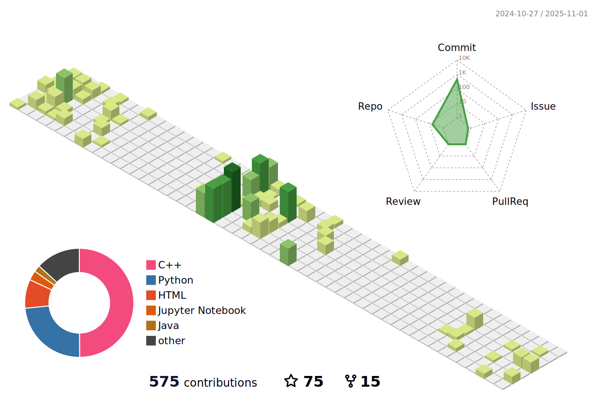

# 👋 Hi, there
- 🌱  I’m currently studying computer science and technology at HUST.
- 😆  Record the learning process of a novice from zero to one.
- 💥  I’m looking forward to getting acquainted with more people.
- 📫  How to reach me: 3508529368@qq.com
- 📌  Wechat: ww000000001_
- 💻  I am using:
  
  
  
  

<!--   my-ticker -->    

<!--   GitHub stats graph -->
### 📈 GitHub Activity Graph:
<!--  -->

| .                                                                                                                                       | .                                                                                                                         |
|-----------------------------------------------------------------------------------------------------------------------------------------|---------------------------------------------------------------------------------------------------------------------------|
|  |  |

</img>

<!--   profile-green-animate -->

<!--   grid-snake -->

<!--   skyline 

-->

<!--  2d history skills -->
</img>

<!---
wwjjll-coder/wwjjll-coder is a ✨ special ✨ repository because its `README.md` (this file) appears on your GitHub profile.
You can click the Preview link to take a look at your changes.
--->
